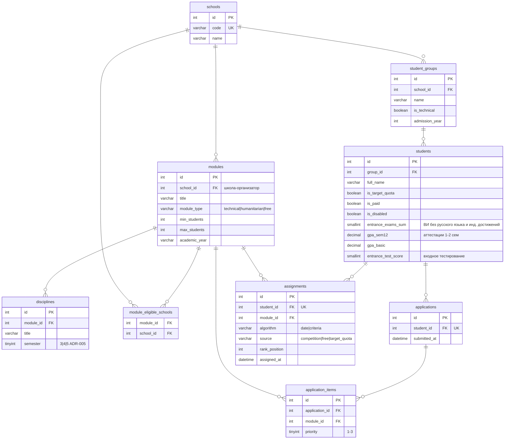

# 🎓 Students Ranking

Автоматическое распределение всего контингента студентов 1 курса ТПУ (один год приёма, одна форма обучения, один уровень квалификации — правило R-01) на модули дополнительной специализации (МДС).

Два алгоритма ранжирования — **по дате подачи заявки** и **по комплексу критериев**; после работы каждого формируется отчётный текстовый файл на каждую инженерную школу. Всё без фреймворков: PHP-классы, чистое ООП-ядро, MySQL, тесты и статический анализ на максимальном уровне.

Это выполненное [тестовое задание на ведущего программиста](docs/test-task.md).

- **Статус:** реализован полный контур CLI + веб; 285 тестов PHPUnit зелёные; PHPStan level max — 0 ошибок; CI в GitHub Actions.
- **Стек:** PHP 8.3, MySQL 8.4, Docker, Composer.
- **Лицензия:** MIT ([LICENSE](LICENSE)).

---

## Оглавление

1. [Возможности](#возможности)
2. [Термины и вводные данные ТЗ](#термины-и-вводные-данные-тз)
3. [Алгоритм распределения](#алгоритм-распределения)
4. [Стратегии ранжирования](#стратегии-ранжирования)
5. [Бизнес-правила R-01…R-20](#бизнес-правила-r-01r-20)
6. [Допущения и вопросы заказчику](#допущения-и-вопросы-заказчику)
7. [Стек и его обоснование](#стек-и-его-обоснование)
8. [Архитектура](#архитектура)
9. [Схема базы данных](#схема-базы-данных)
10. [Установка и запуск](#установка-и-запуск)
11. [CLI: распределение и отчёты](#cli-распределение-и-отчёты)
12. [Веб: форма распределения](#веб-форма-распределения)
13. [Миграции и сидер](#миграции-и-сидер)
14. [Импорт заявок из файла](#импорт-заявок-из-файла)
15. [Тесты, PHPStan, CI](#тесты-phpstan-ci)
16. [Файловая структура](#файловая-структура)
17. [Дорожная карта](#дорожная-карта)
18. [Troubleshooting](#troubleshooting)

---

## Возможности

- **CLI-контур** (`make distribute` / `php bin/console distribute`): данные из БД → распределение → запись результата в `assignments` → отчётные файлы по школам → ZIP-архив.
- **Веб-контур** (`make web`): форма на `http://127.0.0.1:8080/` — источник заявок (файл CSV/TSV или заявки из БД), алгоритм (`date`/`criteria`), формат (`csv`/`tsv`) → скачивание ZIP. CLI и веб используют одно ядро и один контур экспорта.
- **Два алгоритма ранжирования** (R-17) — паттерн «Стратегия» + фабрика (`--algorithm=date|criteria`).
- **Импорт заявок из файла** (веб): построчные ошибки «файл: строка N: причина», приоритеты {1..N}, N ∈ 1..3, блокировка частичного импорта.
- **Детерминированный сидер**: 7 школ, 400 студентов, 17 модулей, 352 заявки / 1056 позиций, краевые когорты (целевики, в т.ч. 8 без заявки; «молчуны»; инвалиды; платники; недоборный модуль).
- **Качество**: PHPUnit (юнит + интеграционные round-trip), PHPStan level max + strict-rules, покрытие pcov, CI, автогенерация mermaid-схемы из DBML.

## Термины и вводные данные ТЗ

- **Модуль** — набор из 3 дисциплин, изучаемых в семестрах 3, 4, 5 (R-02). Номера семестров хранятся в данных, не хардкодятся (ADR-005).
- **Типы модулей** (R-03): технический / гуманитарный / свободный. Свободных модулей ровно 3, каждый закреплён за определёнными школами (R-19, таблица `module_eligible_schools`).
- **min / max модуля** (R-04): минимум для открытия, максимум для записи (мест). Модуль открыт, если записалось и распределилось **больше** минимума (R-05; порог строго `>`, вопрос Q-01). max — лимит мест, а не приём заявок (R-06).
- **Заявки** (R-12): подаются в течение 1 учебной недели; студент выбирает до 3 модулей с приоритетами 1..3 и только модули своего типа группы (R-13).
- **Целевая квота** идёт вне конкурса (R-14); **платники** ранжируются выше бюджетников (R-15); **инвалиды** получают дополнительный балл рейтинга (R-16).
- Инвариант (R-11): студент распределён ровно на один модуль, распределены обязательно все.

## Алгоритм распределения

Многопроходное «жадное» размещение в `App\Application\Distribution\DistributionService` (фазы 0–5 с каскадом 3.5):

| Фаза | Действие |
|---|---|
| **0** | Целевики с заявками — вне конкурса (R-14, ADR-006): по приоритетам 1→3, только модули своего типа, порядок среди целевиков — по дате подачи заявки. |
| **1** | Предварительное закрытие модулей по спросу: если по всем приоритетам заявок ≤ min (Q-01) — модуль считается неоткрытым (R-07). |
| **1.1** | Переобход целевиков, освободившихся после закрытий. |
| **2** | Ранжирование конкурсного пула: все не-целевики с заявками; глобальный порядок задаёт выбранная стратегия (ADR-007 — пул `RankingCandidate`). |
| **3** | Обход пула по порядку стратегии: студент берёт место приоритета 1, если модуль открыт и есть место; иначе переходит к следующему приоритету (R-08). |
| **3.5** | Каскад закрытий до неподвижной точки: записалось ≤ min → записи аннулируются (void), переобход целевиков, затем конкурсного пула; повторяется до сходимости. |
| **4** | Хвосты: не прошедшие ни на один модуль (R-09) и «молчуны» без заявок (R-10) → свободные модули своей школы (R-19). Целевик **без заявки** → вне конкурса на профильный модуль своего типа (ADR-004, флаг `config/distribution.php`). |
| **5** | Финализация `provisional → final`, проверка инвариантов I-01…I-06. |

Инварианты выхода:

- **I-01** — каждый студент ровно в одном final-назначении (R-11);
- **I-02** — заполненность `≤ max` у всех модулей;
- **I-03** — любой модуль с final-записями заполнен `> min`;
- **I-04** — закрытые модули имеют 0 final-записей;
- **I-05** — конкурсные назначения только у студентов с заявкой, тип модуля = тип группы;
- **I-06** — свободные модули содержат только записи фазы 4.

**Детерминизм**: порядки переборов стабильны (даты ASC → id ASC; свободные модули по id ASC; входные массивы не мутируются). Каскад 3.5 сходится за конечное число итераций (не более числа модулей).

## Стратегии ранжирования

`RankingStrategyInterface` + `RankingStrategyFactory` (единая точка для CLI и веба, R-17).

**Алгоритм 1 — по дате подачи** (`DateBasedRanking`). Глобальный порядок конкурсного пула:

1. `submitted_at` ASC;
2. критериальный ключ DESC (тай-брейк равных дат, Q-02);
3. `student_id` ASC.

**Алгоритм 2 — по критериям** (`CriteriaBasedRanking`). Глобальный порядок конкурсного пула:

1. тир платности: платники выше бюджетников (R-15 — тир, не аддитивный бонус);
2. взвешенный нормализованный балл DESC (ADR-002);
3. дата подачи ASC;
4. `student_id` ASC.

**Балл** (`CriteriaRating`, ADR-002): min-max нормализация каждой метрики по пулу в диапазон 0–100, взвешенная сумма, инвалидам — аддитивный бонус:

| Компонент | Вес | Что это (R-16) |
|---|---|---|
| `entrance_exams` | 0.40 | сумма результатов ВИ при поступлении (без русского языка и инд. достижений) |
| `gpa_sem12` | 0.25 | средний балл аттестации за 1–2 семестра по итогам сессии |
| `gpa_basic` | 0.20 | средний балл по базовым предметам |
| `entrance_test` | 0.15 | результаты входного тестирования |
| бонус `disability` | **+10.0** | дополнительный балл студентам-инвалидам (после взвешивания) |

Веса/бонусы/тиры — единственный источник [config/ranking.php](config/ranking.php), валидируются `RatingWeights`. Итог: `(int) round((Σ norm·вес + bonus) · 10⁴)` — целая часть для детерминированных сравнений. Вырожденный диапазон метрики (min = max по пулу) нормализуется в 100.

## Бизнес-правила R-01…R-20

| Правило | Суть |
|---|---|
| R-01 | Контингент: 1 курс, один год приёма, одна форма обучения, один уровень квалификации |
| R-02 | Модуль = 3 дисциплины в семестрах 3, 4, 5 (номера в данных) |
| R-03 | Типы модулей: технический / гуманитарный / свободный |
| R-04 | min — минимум для открытия; max — максимум для записи |
| R-05 | Модуль открыт, если заполнен строго **больше** min (Q-01) |
| R-06 | max — лимит мест (приём заявок не ограничивается) |
| R-07 | Модуль не открыт → его заявки не участвуют, предлагается следующий приоритет |
| R-08 | Модуль открыт, студент по рейтингу ниже max → следующий приоритет |
| R-09 | Не прошедшие ни на один модуль → свободные модули |
| R-10 | Не подавшие заявку → сразу свободные модули, кроме целевой квоты (ADR-004) |
| R-11 | Студент распределён ровно на 1 модуль; распределены все |
| R-12 | Окно подачи — 1 учебная неделя; до 3 модулей с приоритетами 1..3 (непрерывный ряд) |
| R-13 | Студент выбирает только модули своего типа (по группе) |
| R-14 | Целевая квота — вне конкурса (ADR-006) |
| R-15 | Платники ранжируются выше бюджетников (тир) |
| R-16 | Состав рейтинга: ВИ без рус. языка, ср. балл 1–2 сем., ср. балл базовых предметов, входное тестирование, инвалидам доп. балл |
| R-17 | Два алгоритма: по дате подачи и по критериям |
| R-18 | Выход: файл на каждую инженерную школу; колонки: уч. год, № семестра, ИД дисциплины, ИД студента (ADR-001/003) |
| R-19 | Свободных модулей ровно 3, каждый закреплён за определёнными школами |
| R-20 | Приоритет 1 открыт и студент записан → приоритеты 2–3 закрываются |

## Допущения и вопросы заказчику

**ADR (решения и допущения):**

| ID | Что зафиксировано |
|---|---|
| ADR-001 | Отчётные файлы группируются по **школе-организатору** модуля (`modules.school_id`) |
| ADR-002 | Веса рейтинга — в `config/ranking.php`; min-max нормализация в 0–100 |
| ADR-003 | Экспорт `csv`/`tsv` через enum + CLI-флаг: CSV = `;` + BOM UTF-8 + CRLF; TSV = `\t` + LF; имена файлов `{school_code}_{academic_year}.{ext}` в `var/export/` |
| ADR-004 | Целевик **без заявки** → вне конкурса на профильный модуль своего типа (флаг `target_quota_no_application_strategy=profile_module` в `config/distribution.php`) |
| ADR-005 | Семестры 3–4–5 по ТЗ, хранятся в данных (`disciplines.semester`) |
| ADR-006 | Целевики в механизме конкурса: заявки учитываются в min/max; «вне конкурса» = без отсечки по рейтингу, но max физический; закрытие модуля аннулирует целевые записи; целевик с заявкой без прохождения → свободные модули |
| ADR-007 | Техническое решение ранжирования: пул `RankingCandidate` (Student + момент подачи) для единообразной сортировки обеих стратегий |

**Закрытые вопросы ТЗ:** Q-01 — порог открытия модуля строго `>` min; Q-02 — тай-брейк алгоритма по дате при равных датах: рейтинг критериев DESC, затем id ASC.

**Вопросы заказчику (Q-C1…Q-C6, статус «допущение в силе»):**

| ID | Вопрос / допущение |
|---|---|
| Q-C1 | Порог открытия: строго больше min |
| Q-C2 | Заявки целевиков учитываются в min/max модуля |
| Q-C3 | «Вне конкурса» освобождает только от отсечки по рейтингу (не от max) |
| Q-C4 | Целевик без заявки → профильный модуль (config-флаг) |
| Q-C5 | Группировка отчётных файлов — по школе-организатору |
| Q-C6 | Тай-брейк алгоритма по дате при равных датах — рейтинг DESC, затем id |

## Стек и его обоснование

| Компонент | Версия | Зачем |
|---|---|---|
| PHP | 8.3 (NTS, Alpine) | Язык ТЗ. `strict_types`, `readonly`-классы, `enum`, named arguments, PSR-12 |
| MySQL | 8.4 (InnoDB, utf8mb4) | СУБД по стеку проекта |
| Docker | `php:8.3-cli-alpine` + `mysql:8.4` | Окружение из коробки; в образе — pcov для покрытия |
| Composer | 2 | Автозагрузка PSR-4 `App\` → `src/` |

Пакеты — только узкие и изолированные (никаких фреймворков и ORM):

- `symfony/console ^7.1` — командный компонент **для CLI-обвязки** (не фреймворк);
- `league/csv ^9.0` — CSV/TSV для экспорта отчётов и импорта заявок;
- dev: `phpunit ^11.5`, `phpstan ^2.0` + `phpstan-strict-rules`, `fakerphp/faker ^1.24` (детерминированный сидер), `phpunit/php-code-coverage ^11.0`.

Почему без Laravel/Doctrine: ТЗ требует «код в виде классов на PHP, продемонстрировать возможности ООП». Ядро строится на интерфейсах, стратегиях, фабриках, DTO, value-объектах и `readonly`-классах — это читается ревьюером лучше, чем фреймворковый маппинг.

## Архитектура

Слои (PSR-4, `App\` → `src/`):

- **Domain** — модели (`School`, `StudentGroup`, `Student`, `Module`, `Discipline`, `Application`, `Assignment`, `RankingCandidate`), enum (`ModuleType`, `ModuleStatus`, `AssignmentSource`, …), value-объекты (`AcademicYear`, `Semester`, `RatingWeights`), чистый сервис `ApplicationValidator` (R-13). Не знает о БД и файлах.
- **Application** — сценарии: `DistributionService`, стратегии ранжирования (`RankingStrategyInterface`, `CriteriaRating`), экспорт (`FileExporterInterface`, `ExporterFactory`, `SchoolReportAssembler`), импорт заявок (`ApplicationImporterInterface`).
- **Infrastructure** — PDO-репозитории за контрактами (`StudentRepositoryInterface`, `ModuleRepositoryInterface`, `ApplicationRepositoryInterface`), файлы (`ZipArchiver`, `ReportApplicationImporter`), Seeder.
- **Ui** — CLI: `DistributeCommand`, `RankingStrategyFactory`; веб: `WebWorkflow`, `WebResult`, `public/index.php`.

Две точки входа — `bin/console` и `public/index.php` — собирают одинаковую связку (PdoFactory, репозитории, `RatingWeights`, PHP-конфиги) и вызывают одни и те же Application-сервисы. CLI и веб делят контур экспорта, поэтому результаты для одного формата совпадают.

```
students ──┐ modules ──┤ applications ─┘ groups ──┐
            ▼          (репозитории на чтение)
  DistributionService  ←  RankingStrategy (date|criteria)
            ▼
  assignments (final)  ── DELETE + INSERT ──→ БД
            ▼
  SchoolReportAssembler → {school_code}_{year}.{ext} → ZIP
        (CLI: файл + печать путей) / (веб: HTTP-отдача архива)
```

Веб-конвейер `WebWorkflow`: источник (файл или БД) → импорт (построчные ошибки) → валидация R-13 → `DistributionService` → экспорт → ZIP. Веб — «эфемерный» слой: заявки из загруженного файла в БД **не пишутся** (БД только на чтение).

## Схема базы данных

Источник истины — [database/schema.dbml](database/schema.dbml). Mermaid-диаграмма автогенерируется (`make dbml`, см. [docs/schema.mmd](docs/schema.mmd)):



Таблицы: `schools`, `student_groups`, `students`, `modules`, `disciplines`, `module_eligible_schools`, `applications`, `application_items`, `assignments`.

**Нормализация до 3НФ:**

- метрики рейтинга — колонки одного `students` (нет повторяющихся групп фактов в заявках);
- заявка = заголовок `applications` (одна `submitted_at`) + позиции `application_items` (`module_id`, `priority`) — момент подачи один на заявку и не дублируется на позицию;
- назначение `assignments` — результат работы алгоритма: источник (`competition|free|target_quota`), алгоритм, позиция в рейтинге; студент уникален (UK);
- связь «свободный модуль ↔ школы» вынесена в `module_eligible_schools` (R-19) без дублирования.

## Установка и запуск

Предусловия: Docker Desktop (Windows) или Docker Engine + плагин `compose`; `make`.

```sh
# 1. Клонирование
git clone <url> students-ranking && cd students-ranking

# 2. Окружение (при желании поправьте порты/пароли)
cp .env.example .env                        # на Windows: copy .env.example .env
cp config/db.php.example config/db.php      # на Windows: copy config\db.php.example config\db.php

# 3. Сборка и установка зависимостей
make up
make composer-install

# 4. Сброс БД + миграции + демо-данные
make reset-db-migrate-seed
```

Проверка окружения: `make test` (285/285) и `make stan` (0 ошибок).

> Makefile кроссплатформенный: рецепты на Windows идут через `cmd.exe`, но docker-команды исполняются в контейнерах, поэтому отличия переводов строк (`\r\n`) не мешают.

## CLI: распределение и отчёты

```sh
# дефолты Makefile: алгоритм date, формат tsv
make distribute

# явные значения
make distribute ALGO=criteria FMT=csv

# прямой вызов внутри контейнера (эквивалент make distribute ALGO=... FMT=...)
docker compose exec -T php php bin/console distribute --algorithm=criteria --format=csv
```

Вывод команды: «Алгоритм», «Распределено студентов: N/N (R-11)», таблица модулей (статус, заполнено `fill/max`, `min/max`, источники `competition/free/target_quota`), «Файлы отчётов (K): …», «Архив: …».

- `--algorithm` — обязателен, `date|criteria` (R-17); иное значение → ошибка в stderr, код возврата 1.
- `--format` — необязателен; без него дефолт из `config/export.php` (`csv`).
- Результат пишется в БД (таблица `assignments`; повторный прогон перезаписывает: DELETE + INSERT) и в `var/export/`:
  - `{school_code}_{academic_year}.csv` — CSV: `;`, BOM UTF-8, CRLF (совместимость с Excel);
  - `{school_code}_{academic_year}.tsv` — TSV: `\t`, LF;
  - `students-ranking_<Ymd_His>.zip` — архив всех отчётных файлов.
- Колонки отчётного файла (R-18): `academic_year`, `semester`, `discipline_id`, `student_id`; строки — по дисциплинам модуля (3 на студента, семестры 3/4/5).

## Веб: форма распределения

```sh
make web        # http://127.0.0.1:8080/  (php -S 0.0.0.0:8080 -t public в контейнере)
```

Остановка: Ctrl+C в `make web`; фолбэк — `make web-stop`.

Форма: **алгоритм** (`date`/`criteria`), **формат** (`csv`/`tsv`), **источник заявок**:

- «Файл заявок» — загрузка CSV (`;`/BOM) или TSV (`\t`), колонки `student_id;module_id;priority`;
- «Заявки из базы данных» — заявки сидера из `applications`.

Успех → браузер скачивает ZIP (`application/zip`) + сводку «Источник / Алгоритм / Формат / Распределено студентов: N/N (R-11)». Импорт с ошибками или нарушения R-13 блокируют запуск: страница показывает список причин (построчные «файл: строка N: причина»), архив не отдаётся.

## Миграции и сидер

**Миграции** — PHP-раннер `scripts/migrate.php` (`make migrate`); файлы `database/migrations/001…009` в порядке имён. Журнал `schema_migrations(version, checksum_SHA256, applied_at)`: идемпотентность и контроль изменений (миграция не совпала по checksum → ошибка).

| Миграция | Что создаёт |
|---|---|
| `001_create_schools.sql` | `schools` (id, code UK, name) |
| `002_create_student_groups.sql` | `student_groups` (school_id FK, is_technical, admission_year) |
| `003_create_students.sql` | `students` (group_id FK, метрики рейтинга, флаги КЦ/платник/инвалид) |
| `004_create_modules.sql` | `modules` (school_id FK-организатор, type, min/max, academic_year) |
| `005_create_disciplines.sql` | `disciplines` (module_id FK, semester 3\|4\|5) |
| `006_create_module_eligible_schools.sql` | связь «свободный модуль → школы» (R-19) |
| `007_create_applications.sql` | `applications` (student_id FK, submitted_at) |
| `008_create_application_items.sql` | `application_items` (application_id, module_id, priority 1–3) |
| `009_create_assignments.sql` | `assignments` (уникальный student_id, module_id, algorithm, source, rank_position, assigned_at) |

**Сидер** — `scripts/seed.php` (`make seed`; полный цикл — `make reset-db-migrate-seed`): TRUNCATE-протокол → каталог (7 школ, группы, 400 студентов, 17 модулей: 8 технических + 5 гуманитарных + 3 свободных + 1 недоборный) → когорты (`EdgeSeeder`): целевики 30 (25 тех. + 5 гум., из них 8 **без заявки**), «молчуны» 40, инвалиды 10 (5+5), платники 50; 125 студентов когорт, база 275 → заявки (`ApplicationSeeder`): 352 заявки / 1056 позиций в окне 2026-09-07…2026-09-13 (1 учебная неделя, R-12), приоритетные ряды {1..N}, N ∈ 1..3. Детерминирован (Faker с фиксированным сидом), идемпотентен.

## Импорт заявок из файла

Формат: CSV — разделитель `;`, опциональный BOM UTF-8; TSV — таб. Разделитель определяется автоматически (BOM/первая строка). Обязательные колонки-идентификаторы (порядок не важен):

| Колонка | Назначение |
|---|---|
| `student_id` | ИД студента из каталога |
| `module_id` | ИД модуля |
| `priority` | приоритет выбора (1..3) |

Пример:

```
student_id;module_id;priority
3;7;1
3;12;2
12;7;1
```

Правила: приоритеты одной заявки — непрерывный ряд {1..N}, N ∈ 1..3 (R-12); без дублей пары (студент, приоритет) и (студент, модуль); `submitted_at` = момент импорта (окно подачи R-12). Любая ошибка строки («файл: строка N: причина») блокирует **весь** импорт — частичное применение запрещено.

## Тесты, PHPStan, CI

| Цель Makefile | Что делает |
|---|---|
| `make test` | PHPUnit: юнит (Domain / Application / Ui / Infrastructure) + интеграционные round-trip (сидер, репозитории, распределение, команда) — **285/285** |
| `make stan` | PHPStan **level max** + `phpstan-strict-rules` по `src/`, `tests/`, `config/`, `scripts/` — 0 ошибок |
| `make coverage` | покрытие pcov по ядру `src/Application/Distribution` |
| `make dbml` | генерация `docs/schema.mmd` из `database/schema.dbml` (Node, `@dbml/core`) |
| `make stan-test` | `stan` + `test` подряд |
| `make mysql` | интерактивный MySQL-клиент (`--default-character-set=utf8mb4`) |

CI — [.github/workflows/ci.yml](.github/workflows/ci.yml):

- job **tests**: PHP 8.3 (native) + сервис MySQL, `composer install`, миграции + сид, `phpunit`, `phpstan`;
- job **schema-docs**: при изменении `database/schema.dbml` на push — регенерация и коммит `docs/schema.mmd`.

## Файловая структура

```
students-ranking/
├─ .editorconfig              # единые отступы/кодировка для всех редакторов
├─ .env.example               # параметры docker-compose (порты, пароли MySQL)
├─ .gitignore                 # vendor/, var/, config/db.php, data-vault/, .env …
├─ .dockerignore              # что не попадает в образ
├─ .gitattributes             # * text=auto eol=lf
├─ LICENSE                    # MIT
├─ README.md                  # этот файл
├─ Makefile                   # цели: up/down/migrate/seed/distribute/web/test/stan/…
├─ composer.json              # метаданные, autoload PSR-4 App\ → src/
├─ phpstan.neon               # PHPStan level max + strict-rules
├─ phpunit.xml.dist           # конфигурация PHPUnit (failOnWarning/Risky)
├─ docker-compose.yml         # сервисы php (php:8.3-cli-alpine) и mysql (8.4)
├─ docker/php/Dockerfile      # образ PHP: расширения, pcov, memory_limit
├─ bin/console                # CLI-точка входа Symfony Console (собирает связку, регистрирует команду distribute)
├─ config/
│  ├─ db.php.example          # шаблон соединения с БД (копируется в db.php; db.php в .gitignore)
│  ├─ distribution.php        # флаг ADR-004: profile_module|free_module
│  ├─ export.php              # дефолтный формат и каталог отчётов (ADR-003)
│  └─ ranking.php             # веса/бонусы/тиры рейтинга (ADR-002)
├─ database/
│  ├─ schema.dbml             # источник истины схемы БД
│  └─ migrations/001…009      # DDL-миграции
├─ docs/
│  ├─ schema.mmd              # mermaid-схема (автоген из schema.dbml)
│  └─ test-task.md            # полный текст тестового задания
├─ public/index.php           # веб-точка входа: форма → WebWorkflow → ZIP
├─ scripts/
│  ├─ db-reset.php|.sh        # сброс БД (+ migrate/seed как аргумент)
│  ├─ migrate.php|.sh         # раннер миграций
│  ├─ seed.php|.sh            # сидер (каталог + когорты + заявки)
│  ├─ docker-test.sh          # PHPUnit в контейнере
│  ├─ docker-stan.sh          # PHPStan в контейнере
│  ├─ docker-coverage.sh      # покрытие pcov
│  ├─ docker-web.sh           # запуск php -S :8080   (make web)
│  └─ docker-web-stop.sh      # остановка веб-сервера   (make web-stop)
├─ src/
│  ├─ Domain/                 # модели, enum, value-объекты, ApplicationValidator
│  ├─ Application/            # DistributionService, Ranking*, Export*
│  ├─ Infrastructure/         # PDO-репозитории, File (ZIP/импорт), Seeder
│  └─ Ui/                     # Cli (DistributeCommand, RankingStrategyFactory), Web (WebWorkflow)
├─ tests/
│  ├─ Unit/                   # юнит-тесты: Domain, Application, Ui, Infrastructure
│  └─ Integration/Db/         # интеграционные round-trip
├─ tools/dbml/                # Node-утилита DBML → mermaid (render.cjs)
└─ var/                       # gitignored: export/ (отчётные файлы и ZIP)
```

## Дорожная карта

Фичи, **сознательно не вошедшие** в тестовое задание, по слоям реализации:

- **Tier 1 (обязательные для продакшена):** реестр запусков распределения (`distribution_runs` + артефакты); сравнение двух алгоритмов на одном наборе заявок; полный пайплайн загрузки файлов с построчными ошибками (ядро есть — импорт B4-03; добавить сохранение сессий/незавершённых итогов); потоковая отдача файлов/архивов (сейчас веб отдаёт ZIP в памяти).
- **Tier 2 (желательные):** минимальный JSON API (ошибки по RFC 9457) вместо/вместе с формой; безопасность без авторизации — CSRF-токен, ограничения загрузок (экранирование вывода и prepared-запросы уже есть); наблюдаемость — PSR-3-логгер и `GET /healthz`; 12-factor-конфигурация (сейчас параметры в PHP-конфигах + `.env` для docker-compose).
- **Tier 3 (опциональные):** nginx + php-fpm вместо `php -S`; `make bench` (замер на больших объёмах); HTTP-интеграционные тесты.
- **Вне scope (не реализуются намеренно):** авторизация/роли, личные кабинеты, JS/SPA-фреймворки, очереди/джобы, WebSocket, микросервисы.

## Troubleshooting

| Симптом | Решение |
|---|---|
| Кириллица «????» в mysql-клиенте | `make mysql` уже использует `--default-character-set=utf8mb4` |
| Веб: «В базе данных нет заявок» | Наполните БД: `make reset-db-migrate-seed` |
| Порт 8080/3306 занят | Поправьте порты в `.env` и повторите `make up` |
| Dev-сервер не остановился (порт занят) | `make web-stop` |
| `config/db.php` отсутствует | Скопируйте `config/db.php.example` → `config/db.php` |
| `vendor/` отсутствует | `make composer-install` |
| Изменилась `database/schema.dbml` | Обновите диаграммы: `make dbml` (генерирует `docs/schema.mmd`) |
| Повторный прогон `make distribute` | Перезаписывает `assignments` (DELETE + INSERT) и файлы в `var/export/` — не атомарно |